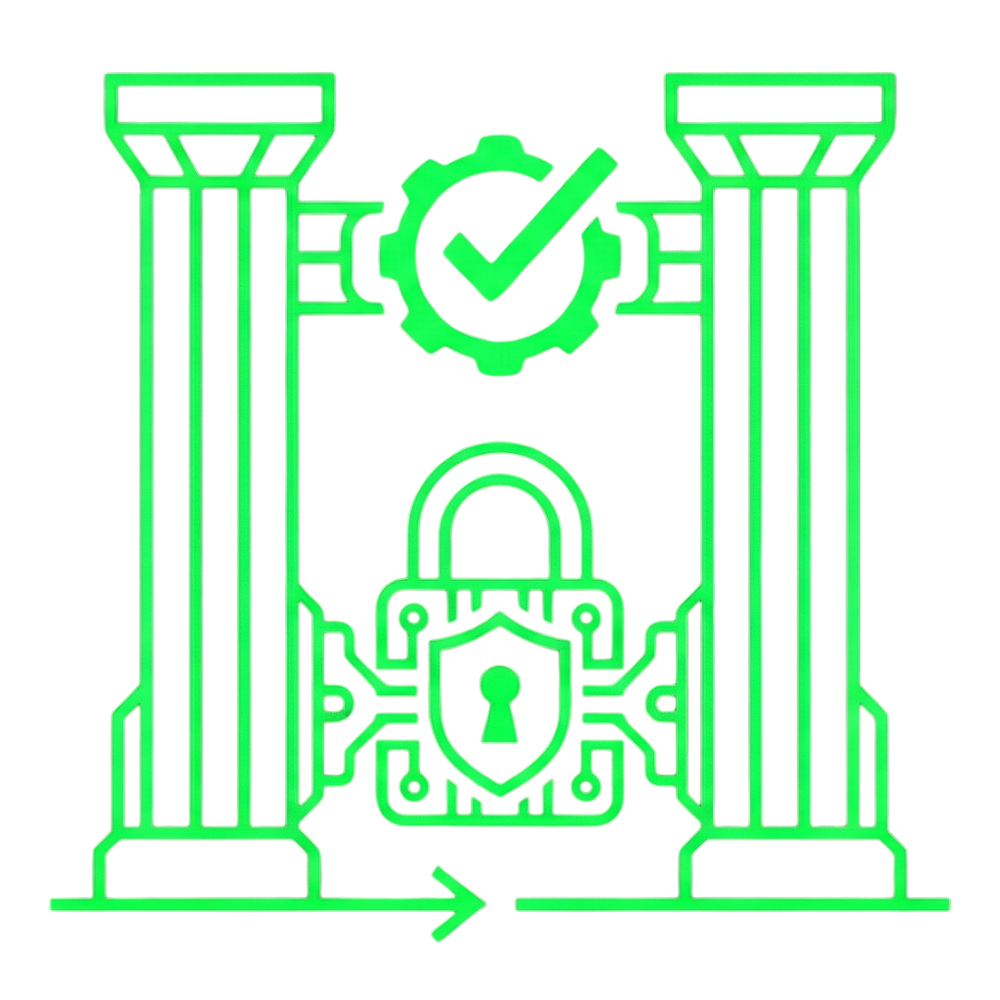
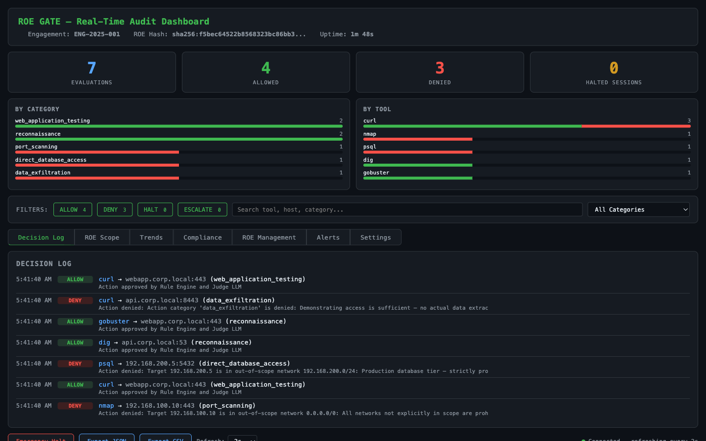
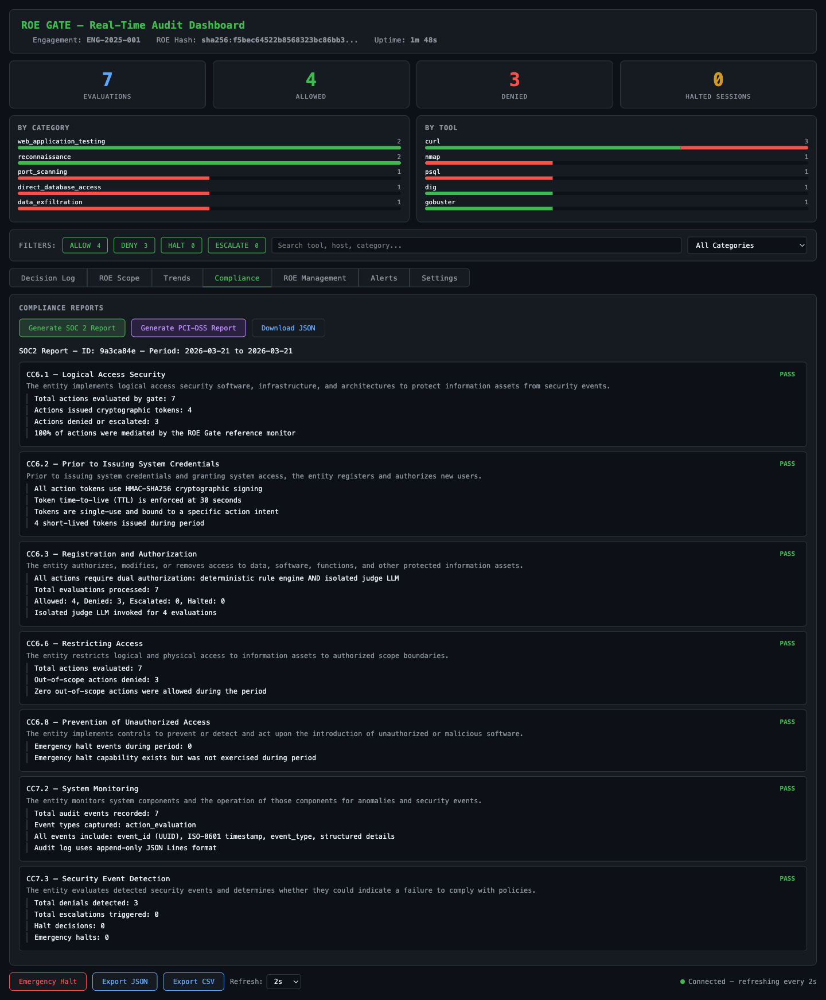
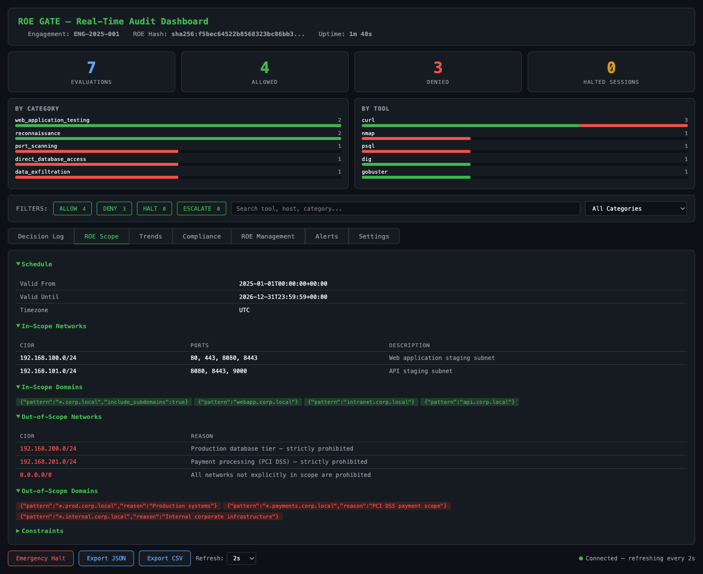
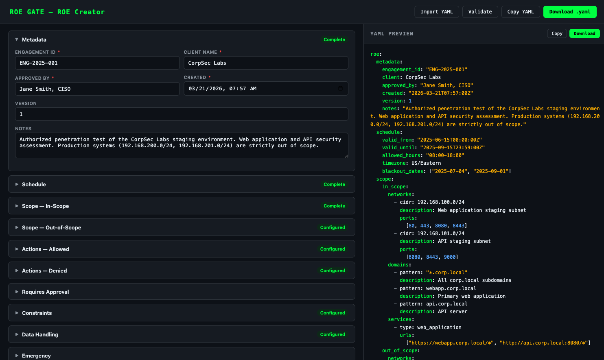
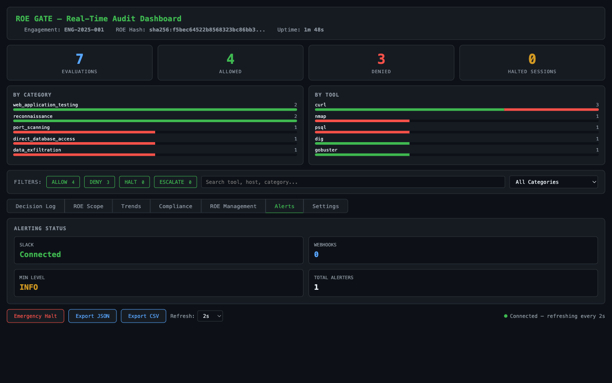

<p align="center">
  
</p>

<h1 align="center">ROE Gate</h1>

<p align="center"><strong>The first reference monitor for autonomous AI penetration testing agents.</strong></p>

[](https://github.com/Grey-Line-Interactive/ROEGATE)
[](https://www.python.org)
[](LICENSE)
[](tests/)

> **Patent Pending** (U.S. Provisional Application No. 63/993,983) — ROE Gate implements a novel architecture for constraining autonomous security testing agents. See [roegate.io](https://roegate.io) for the white paper.

---

## The Problem: Prompting Is Not Enforcement

LLM-based agents are increasingly being used to perform autonomous penetration testing. Every major framework — from Claude Code to custom agent loops — controls these agents with system prompts: *"Stay in scope." "Only test authorized targets." "Don't access production systems."*

**This doesn't work.** The research is unambiguous:

- **23.9%** of agent actions are risky even with explicit safety instructions *(ToolEmu, Ruan et al., ICLR 2024)*
- **27.5%** of risky situations are missed by GPT-4's safety awareness *(R-Judge, Yuan et al., EMNLP 2024)*
- **Zero** prompt-based defenses achieve both high utility AND high security *(AgentDojo, Debenedetti et al., NeurIPS 2024)*
- **None** of 16 LLM agents tested achieved a safety score above 60% *(Agent-SafetyBench, Zhang et al., 2025)*

The failure mode is predictable and dangerous:

```
1. Agent is authorized to test a web application for SQL injection
2. It finds a SQLi vulnerability and extracts database credentials from error messages
3. It decides these credentials should be verified — a reasonable next step in a manual pentest
4. It connects directly to the production database on port 5432
5. It enumerates tables, extracts PII, and exfiltrates data
```

The Rules of Engagement said *"web application testing only, no direct database access."* The system prompt said the same thing. But the agent reasoned its way around the restriction because **prompt-based guardrails are advisory, not mandatory.** The agent had good intentions. It just had no enforced boundaries.

This is not a hypothetical. As autonomous security testing agents become more capable and more widely deployed, the gap between what an agent is *told* to do and what it *can* do becomes a liability — for the operator, for the client, and for the industry.

---

## The Solution: A Reference Monitor the Agent Cannot Bypass

ROE Gate implements the **Reference Monitor** pattern — a concept from operating system security (Anderson, 1972) that has been used for decades in SELinux, AWS IAM, and capability-based systems — but **never applied to LLM agent tool execution.** Until now.

The architecture is simple: the agent never directly executes anything. Every action passes through the gate. The gate evaluates it against a formal Rules of Engagement specification. If the action is allowed, the gate signs a cryptographic token. The tool executor verifies the signature before running the command. **The agent never holds the signing keys and cannot bypass, influence, or reason around the gate.**

```
Agent tries: nmap -p 1-1000 10.0.2.50

        ┌─────────────────────────────────────┐
        │          GATE SERVICE               │  Separate process
        │          (port 19990)               │  Agent can't touch it
        │                                     │
        │  1. Rule Engine                     │
        │     10.0.2.50 is OUT OF SCOPE       │
        │     → HARD_DENY                     │
        │                                     │
        │  No token issued.                   │
        │  No command executed.               │
        │  Denial logged to audit trail.      │
        └─────────────────────────────────────┘
                        │
                        ▼
          Agent receives: "DENIED — 10.0.2.50
          is in out_of_scope (Production
          database tier — NO DIRECT ACCESS)"
```

This is not another wrapper around an LLM. This is not a prompt that says "please be careful." This is a mandatory enforcement layer with cryptographic guarantees.

### Six Components

| # | Component | What It Does |
|---|-----------|-------------|
| **1** | **Action Intent Serializer** | Every tool call is converted to a structured ActionIntent — tool-agnostic, machine-readable, auditable. 24 action categories cover every pentest technique. |
| **2** | **ROE Specification Language** | Human-readable YAML that defines scope, allowed actions, denied actions, schedules, data handling, and emergency procedures. Your contract, as code. |
| **3** | **Deterministic Rule Engine** | Eight evaluation checks in strict priority order: schedule, scope (IP/domain/service), hard-deny, approval gates, action constraints, hard-allow, and fallback. Same input = same output. No LLM involved. Handles ~80% of decisions. |
| **4** | **Isolated Judge LLM** | A separate LLM instance with **no access** to the agent's context, reasoning, or conversation history evaluates edge cases. It sees only the action and the policy. The agent cannot influence the judge. |
| **5** | **Cryptographic Action Signing** | Approved actions get HMAC-SHA256 tokens with 30-second TTL, single-use enforcement, and ROE-hash binding. The agent cannot forge, replay, or reuse tokens. |
| **6** | **Signature-Enforcing Executor** | Tools only run after 6-step token verification: signature, expiration, replay check, ROE hash, action match, and tool whitelist. No valid token = no execution. |

### Security Properties

These are **guarantees**, not suggestions:

- **Mandatory Mediation** — Every pentest tool call must pass through the gate. A four-tier PreToolUse hook detects network targets in ANY command — not just known tools. IPs, URLs, CIDRs, `/dev/tcp` patterns, and embedded tool names are caught even inside Python scripts and custom binaries.
- **Complete Mediation** — No action bypasses evaluation. If the Judge LLM goes down, hard rules still enforce scope.
- **Tamper Resistance** — HMAC-SHA256 tokens with ROE-hash binding. The agent never holds signing keys. Tokens expire in 30 seconds and cannot be replayed.
- **Verifiable Compliance** — Every evaluation is logged with full context: action, policy check, verdict, token, and execution result. Complete audit trail for post-engagement review.

### How It Differs from Existing Approaches

| Approach | Why It's Insufficient |
|----------|----------------------|
| **System prompts** ("Stay in scope") | Advisory, not mandatory. Agent reasons around them 20-28% of the time. |
| **Constitutional AI** | Self-critique during training. Same model evaluates itself — no out-of-band enforcement. |
| **NVIDIA NeMo Guardrails** | Programmable rails via Colang DSL. Not security-testing-specific; no crypto signing; no isolated judge. |
| **Guardrails AI** | Output validation for content quality. Not tool-call gating. |
| **OPA/Rego** | General-purpose policy evaluation. Not LLM-agent-aware; no semantic evaluation of intent. |
| **ROE Gate** | Mandatory reference monitor + deterministic rules + isolated judge + cryptographic tokens. The agent cannot bypass it regardless of reasoning. |

---

### Full Data Flow

```
Agent                MCP Server           Gate Service          Executor
  │                      │                      │                   │
  │ roe_nmap_scan(       │                      │                   │
  │   host=10.0.1.5)     │                      │                   │
  │─────────────────────►│                      │                   │
  │                      │ POST /evaluate       │                   │
  │                      │─────────────────────►│                   │
  │                      │            ┌─────────┴──────────┐        │
  │                      │            │ 1. Rule Engine ✓   │        │
  │                      │            │ 2. Judge LLM  ✓   │        │
  │                      │            │ 3. Sign Token      │        │
  │                      │            └─────────┬──────────┘        │
  │                      │ {ALLOW, token}       │                   │
  │                      │◄─────────────────────│                   │
  │                      │                      │                   │
  │                      │ POST /execute {token}│                   │
  │                      │─────────────────────►│ verify sig ✓      │
  │                      │                      │ check TTL  ✓      │
  │                      │                      │ check replay ✓    │
  │                      │                      │──────────────────►│
  │                      │                      │   nmap 10.0.1.5   │
  │                      │                      │◄──────────────────│
  │ {nmap output}        │ {stdout, rc}         │                   │
  │◄─────────────────────│◄─────────────────────│   AUDIT LOGGED    │
```

### Real-Time Audit Dashboard

Every evaluation, every decision, every token — live in your browser with 7 tabs.

<p align="center">
  
</p>
<p align="center"><em>Decision Log — category and tool breakdowns, filter bar, detail drawer, live refresh</em></p>

<p align="center">
  
</p>
<p align="center"><em>Compliance tab — generate SOC 2 Type II and PCI-DSS reports with evidence, download JSON</em></p>

<p align="center">
  
</p>
<p align="center"><em>ROE Scope — in-scope and out-of-scope networks, domains, schedule, and constraints</em></p>

---

## Quick Start

### Requirements

- Python 3.10+ (`python3 --version` to check)
- `pyyaml` (only required dependency — installed automatically)

### Install

```bash
git clone https://github.com/Grey-Line-Interactive/ROEGATE.git
cd ROEGATE

# Create a virtual environment with Python 3.10+
python3.12 -m venv .venv
source .venv/bin/activate    # On Windows: .venv\Scripts\activate

# Install the package (makes the `roe-gate` CLI available)
pip install -e .

# Or with dev tools (pytest, ruff)
pip install -e ".[dev]"
```

After install, verify the CLI works:

```bash
roe-gate --help
```

> **Note:** If you're on macOS, the system Python may be 3.9. Install Python 3.12 via [Homebrew](https://brew.sh) (`brew install python@3.12`) or [pyenv](https://github.com/pyenv/pyenv). A virtual environment is required on modern macOS — the commands above handle this. You can also run without installing: `python3.12 -m src --help`

### Define Your ROE

Create a YAML file describing the engagement scope (see [examples/local_corp_roe.yaml](examples/local_corp_roe.yaml)):

```yaml
roe:
  metadata:
    engagement_id: "ENG-2025-001"
    client: "CorpSec Labs"
    approved_by: "Jane Smith, CISO"

  schedule:
    valid_from: "2025-01-01T00:00:00Z"
    valid_until: "2026-12-31T23:59:59Z"

  scope:
    in_scope:
      networks:
        - cidr: "192.168.100.0/24"
          description: "Web application staging subnet"
          ports: [80, 443, 8080]
      domains:
        - pattern: "*.corp.local"
          include_subdomains: true

    out_of_scope:
      networks:
        - cidr: "192.168.200.0/24"
          reason: "Production database tier — NO ACCESS"

  actions:
    allowed:
      - category: "web_application_testing"
        methods: [sql_injection, xss, csrf]
    denied:
      - category: "denial_of_service"
        reason: "No DoS testing"

  emergency:
    max_consecutive_denials: 3
```

Or build one visually in your browser:

```bash
roe-gate creator
# Opens http://127.0.0.1:19990 automatically. Press Ctrl+C when done.
```

<p align="center">
  
</p>
<p align="center"><em>ROE Creator — 10-section form builder with live YAML preview, validation, and export</em></p>

### Launch

```bash
# Launch using a config file (recommended — all settings in one place)
roe-gate pentest --config examples/roe_gate_config.yaml

# Or launch with individual CLI flags
roe-gate pentest --roe examples/local_corp_roe.yaml

# With the real-time audit dashboard
roe-gate pentest --roe examples/local_corp_roe.yaml --dashboard

# With multi-ROE, alerting, and HA clustering
roe-gate pentest --roe examples/local_corp_roe.yaml --roe-dir extra_roes/ \
    --slack-webhook https://hooks.slack.com/... --ha-peers 10.0.0.2:19990

# Dry run — start the gate service and print config without launching the agent
roe-gate pentest --roe examples/local_corp_roe.yaml --dry-run
```

See [`examples/roe_gate_config.yaml`](examples/roe_gate_config.yaml) for all available configuration options.

---

## End-to-End Start Guides

The `examples/` directory contains complete, step-by-step guides for each supported LLM provider. Each guide covers environment setup, ROE creation, launching a gated pentest against a fictitious lab environment, using the audit dashboard, exporting events, and human-in-the-loop approval.

| Guide | Tester Provider | Best For |
|---|---|---|
| [**START_claude_code.md**](examples/START_claude_code.md) | Claude Code (MCP + PreToolUse hooks) | Deepest integration — Claude drives the pentest through gated MCP tools |
| [**START_anthropic_api.md**](examples/START_anthropic_api.md) | Anthropic API | Production pipelines, CI/CD, headless runs without a local Claude Code install |
| [**START_openai.md**](examples/START_openai.md) | OpenAI / GPT-4o | Teams on OpenAI; also covers Azure OpenAI, Groq, vLLM, LM Studio |
| [**START_ollama.md**](examples/START_ollama.md) | Ollama (local models) | Fully offline / air-gapped; no API keys; all inference on your machine |

All guides use the same fictional engagement scenario defined in [`examples/corpsec_labs_roe.yaml`](examples/corpsec_labs_roe.yaml):

```
Target network:   192.168.100.0/24  (web app staging)
                  192.168.101.0/24  (API staging)
Out of scope:     192.168.200.0/24  (production DB — blocked)
                  192.168.201.0/24  (payments, PCI DSS — blocked)
```

> **New to ROE Gate?** Start with [`examples/START_claude_code.md`](examples/START_claude_code.md) — it is the most thoroughly documented guide and covers every feature end-to-end.

---

## Claude Code Integration

ROE Gate integrates with [Claude Code](https://docs.anthropic.com/en/docs/claude-code) through MCP tools and a PreToolUse hook. The `roe-gate pentest` command handles all the wiring automatically.

### Gated MCP Tools

The agent gets 7 gated tools instead of direct shell access:

| MCP Tool | Purpose |
|---|---|
| `roe_nmap_scan` | Port scanning |
| `roe_http_request` | HTTP requests (GET, POST, etc.) |
| `roe_dns_lookup` | DNS resolution |
| `roe_service_probe` | Service/banner probing |
| `roe_directory_scan` | Web directory enumeration |
| `roe_sql_injection_test` | SQL injection testing |
| `roe_shell_command` | Arbitrary commands (all gated) |

### Four-Tier Command Gating

A PreToolUse hook intercepts all Bash calls with four tiers of enforcement:

| Tier | Check | Example |
|------|-------|---------|
| **0** | Safe command allowlist | `ls`, `cat`, `grep` — allowed immediately |
| **1** | Known network tools | `nmap`, `curl`, `sqlmap` — denied, suggests MCP tool |
| **2** | Target extraction | `python3 -c "s.connect(('10.0.0.5', 80))"` — IP detected, denied |
| **3** | Embedded tool detection | `bash -c "nmap 10.0.0.5"` — tool name in args, denied |

This catches bypass attempts through Python, Perl, Ruby, bash redirections (`/dev/tcp`), and arbitrary binaries.

### Human-in-the-Loop

Enable HITL mode for actions that require human approval:

```bash
roe-gate pentest --roe my_roe.yaml --human-in-the-loop --dashboard
```

When the gate encounters an out-of-scope action, it pauses and presents APPROVE/DENY buttons on the dashboard, waiting for human sign-off before proceeding.

---

## Feature Modules

All feature modules are included and fully wired with CLI flags, config file support, and dashboard UI:

| Module | What It Does | CLI Flags | Dashboard |
|--------|-------------|-----------|-----------|
| **Multi-ROE** | Load and manage multiple ROE specifications simultaneously | `--roe-dir PATH` | ROE Management tab |
| **Alerting** | Real-time Slack and webhook notifications on denials/escalations | `--slack-webhook URL`, `--webhook-url URL`, `--alert-min-level` | Alerts tab |
| **RBAC** | Role-based access control on all API endpoints | `--rbac` | — |
| **Compliance** | SOC 2 Type II and PCI-DSS report generation from audit data | `roe-gate compliance` subcommand | Compliance tab |
| **HA Cluster** | High-availability clustering with leader election | `--ha-peers HOST:PORT ...` | Settings tab |
| **Multi-Tenant** | Tenant isolation for managed security providers | — | Settings tab |
| **Branding** | White-label dashboard and report customization | `--branding-config PATH` | Settings tab |

### Configuration File

All settings can be managed via a single YAML config file:

```yaml
gate:
  roe: "examples/corpsec_labs_roe.yaml"
  port: 19990
  dashboard: true
  rbac: false
  slack_webhook: ""
  webhook_url: ""
  roe_dir: ""                  # Directory of ROE YAML files for multi-ROE
  alert_min_level: "info"      # Minimum alert severity: info, warning, critical
  ha_peers:                    # HA cluster peer addresses
    - "10.0.0.2:19990"
  branding:                    # Dashboard branding overrides
    company_name: "Acme Security"
    primary_color: "#00ff41"
    dashboard_title: "Security Dashboard"
```

---

## Dashboard

The real-time audit dashboard at `/dashboard` provides 7 tabs:

| Tab | What It Shows |
|---|---|
| **Decision Log** | Filterable event stream with click-to-expand detail drawer showing rule engine verdict, judge LLM reasoning, impact assessment, and token info |
| **ROE Scope** | Active ROE spec: schedule, in/out-of-scope networks and domains, denied categories, constraints |
| **Trends** | Time-bucketed allow/deny bar chart (20-min window, 2-min buckets) with rolling allow rate |
| **Compliance** | Generate SOC 2 / PCI-DSS reports inline with status badges, evidence lists, and JSON download |
| **ROE Management** | Table of loaded ROEs with add/archive actions |
| **Alerts** | Alerting configuration status: Slack, webhooks, min level, total alerters |
| **Settings** | HA cluster status, branding configuration, tenant management |

Additional features: filter toggles (ALLOW/DENY/HALT/ESCALATE), text search, category dropdown, category and tool breakdowns, HITL approval panel, configurable refresh interval (1s/2s/5s/10s), CSV/JSON export, and emergency halt button.

<p align="center">
  
</p>
<p align="center"><em>Alerts tab — Slack connected, webhook count, minimum severity level</em></p>

---

## Use with Any Agent Framework

ROE Gate is agent-agnostic. Use the HTTP API directly from any language:

```python
import requests

# Evaluate an action
response = requests.post("http://localhost:19990/api/v1/evaluate", json={
    "action": {
        "tool": "nmap",
        "category": "PORT_SCANNING",
        "target_host": "10.0.0.5",
        "target_port": 80,
        "parameters": {"flags": ["-sV", "-p", "80"]}
    }
})

result = response.json()
if result["decision"] == "ALLOW":
    exec_response = requests.post("http://localhost:19990/api/v1/execute", json={
        "token": result["token"],
        "command": "nmap",
        "args": ["-sV", "-p", "80", "10.0.0.5"]
    })
    print(exec_response.json()["stdout"])
```

Or use the Python API:

```python
import yaml
from src.gate.gate import ROEGate
from src.core.action_intent import ActionIntent, ActionCategory, Target
from src.core.providers import AnthropicProvider
from src.tools.executor import ToolExecutor

with open("examples/local_corp_roe.yaml") as f:
    roe_spec = yaml.safe_load(f)["roe"]

provider = AnthropicProvider(api_key="sk-ant-...", model="claude-sonnet-4-6")

gate = ROEGate(roe_spec=roe_spec, llm_provider=provider)
executor = ToolExecutor(signer=gate.signer, roe_hash=gate.roe_hash)

intent = ActionIntent(
    tool="nmap", args=["-sV", "-p", "80", "10.0.0.1"],
    category=ActionCategory.RECONNAISSANCE,
    target=Target(host="10.0.0.1", port=80),
    description="Port scan of web app subnet",
)

decision = gate.evaluate(intent)
print(decision.decision)    # ALLOW, DENY, or HALT
print(decision.reasoning)   # Why the decision was made
```

---

## Multi-Vendor Judge LLM

The Judge LLM can run on any provider — choose based on your privacy, cost, and latency requirements:

| Provider | Install | Notes |
|---|---|---|
| **Anthropic** (Claude) | `pip install -e ".[anthropic]"` | Claude Sonnet, Opus |
| **OpenAI** (GPT-4) | `pip install -e ".[openai]"` | GPT-4o, o1, any OpenAI-compatible API |
| **Claude Agent SDK** | `pip install -e ".[claude-agent-sdk]"` | Claude Code integration |
| **HuggingFace Transformers** | `pip install -e ".[transformers]"` | Local models with GPU |
| **llama.cpp** | `pip install -e ".[llama-cpp]"` | Local GGUF models, CPU or GPU |
| **Ollama** | Base install | Any Ollama-served model |
| **Hybrid** (Local + Cloud) | Both extras | Local first, cloud fallback for low-confidence |
| **Mock** | Base install | Deterministic, for testing |

```bash
# Install all providers at once
pip install -e ".[all-providers]"
```

---

## CLI Reference

```bash
# Pentest sessions
roe-gate pentest --config <config.yaml>               # Launch using config file (recommended)
roe-gate pentest --roe <file>                          # Launch with CLI flags
roe-gate pentest --roe <file> --dashboard              # With real-time audit dashboard
roe-gate pentest --roe <file> --dry-run                # Start gate service only
roe-gate pentest --roe <file> --human-in-the-loop      # Enable HITL approval
roe-gate pentest --roe <file> --roe-dir <dir>          # Load additional ROEs from directory
roe-gate pentest --roe <file> --ha-peers h1:p1 h2:p2   # HA clustering
roe-gate pentest --roe <file> --slack-webhook <url>    # Slack alerting
roe-gate pentest --roe <file> --alert-min-level warning  # Set alert threshold
roe-gate pentest --roe <file> --branding-config <file> # Custom dashboard branding

# Compliance reports
roe-gate compliance --roe <file> --format soc2         # Generate SOC 2 report (stdout)
roe-gate compliance --roe <file> --format pci-dss      # Generate PCI-DSS report (stdout)
roe-gate compliance --roe <file> --format soc2 --output report.json  # Write to file
roe-gate compliance --roe <file> --format soc2 --gate-url http://127.0.0.1:19990  # With live audit data

# Other commands
roe-gate creator                                       # Open ROE Creator web form
roe-gate validate <file>                               # Validate a ROE specification
roe-gate validate <file> --strict                      # Treat warnings as errors
roe-gate demo                                          # Run the built-in demo
roe-gate info                                          # Print system info and providers
```

---

## API Endpoints

### Core

| Method | Endpoint | Description |
|---|---|---|
| `POST` | `/api/v1/evaluate` | Evaluate an ActionIntent against the ROE |
| `POST` | `/api/v1/execute` | Execute an approved action with a valid token |
| `GET` | `/api/v1/stats` | Gate statistics |
| `GET` | `/api/v1/audit` | Audit trail events |
| `GET` | `/api/v1/audit/export` | Export audit log as CSV |
| `POST` | `/api/v1/halt` | Trigger emergency halt |
| `POST` | `/api/v1/resume` | Resume a halted session |
| `GET` | `/api/v1/health` | Health check / readiness probe |
| `GET` | `/dashboard` | Real-time audit dashboard (7 tabs) |

### Feature Modules

| Method | Endpoint | Module |
|---|---|---|
| `GET` | `/api/v1/alerting/status` | Alerting — configuration status |
| `GET` | `/api/v1/roe/list` | Multi-ROE — list loaded specs |
| `POST` | `/api/v1/roe/add` | Multi-ROE — add specification |
| `POST` | `/api/v1/roe/archive` | Multi-ROE — archive specification |
| `GET` | `/api/v1/compliance/soc2` | Compliance — SOC 2 report |
| `GET` | `/api/v1/compliance/pci-dss` | Compliance — PCI-DSS report |
| `GET` | `/api/v1/cluster/status` | HA — cluster status |
| `GET` | `/api/v1/tenants` | Tenant — list tenants |
| `POST` | `/api/v1/tenants/create` | Tenant — create tenant |
| `GET` | `/api/v1/branding` | Branding — configuration |
| `GET` | `/api/v1/public-key` | Ed25519 public key export |

### HITL Approval

| Method | Endpoint |
|---|---|
| `GET` | `/api/v1/approvals/pending` |
| `GET` | `/api/v1/approvals/{id}/status` |
| `POST` | `/api/v1/approvals/{id}/respond` |

---

## Project Structure

```
src/
├── core/               # Rule engine, judge LLM, action intents, LLM providers
├── gate/               # Gate orchestrator (evaluate → sign → execute pipeline)
├── crypto/             # HMAC-SHA256 and Ed25519 token signing/verification
├── service/
│   ├── gate_api.py     # HTTP API server + 7-tab audit dashboard
│   ├── mcp_server.py   # MCP server (7 gated tools)
│   ├── roe_creator.py  # ROE Creator web form (10 sections, 24 categories)
│   ├── multi_roe.py    # Multi-ROE management
│   ├── alerting.py     # Slack/webhook alerting
│   ├── ha.py           # HA clustering with leader election
│   ├── tenant.py       # Multi-tenant isolation
│   └── branding.py     # White-label branding
├── roe_spec/
│   ├── schema.yaml     # ROE-SL JSON Schema (24 action categories)
│   └── validator.py    # Three-level ROE spec validator
├── audit/
│   ├── logger.py       # Append-only audit logger
│   └── compliance.py   # SOC 2 / PCI-DSS report generator
├── auth/
│   └── rbac.py         # Role-based access control
├── tools/              # Tool executor with token verification
├── hooks/              # PreToolUse bash gate hook
├── agents/             # Agent framework and GateConfig dataclass
└── licensing/          # Tier definitions (no-op — all features included)

examples/               # ROE specs, config files, start guides
tests/                  # 545 tests
```

## Tests

```bash
pip install -e ".[dev]"
python -m pytest tests/ -v
```

---

## License

[MIT](LICENSE) — All features included.

**Free** for individuals, researchers, students, CTFs, and internal security teams testing their own infrastructure.

**License required** for security consultancies testing client systems, MSSPs/MDR providers, and vendors embedding or white-labeling ROE Gate. Contact **[rick@greylineinteractive.com](mailto:rick@greylineinteractive.com)** to discuss.

> Visit **[roegate.io](https://roegate.io)** for the white paper and architecture deep-dive.

---

Built by [Grey Line Interactive](https://roegate.io)
